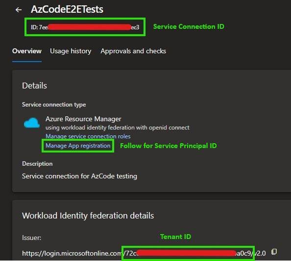
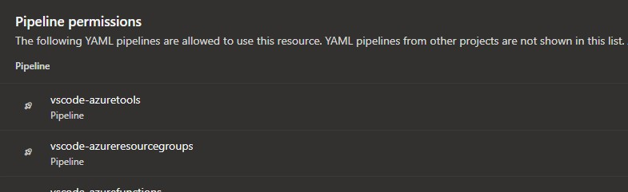

# Setting up workflow identity federation with Azure DevOps

This guide describes how to set up your Azure DevOps (ADO) and Azure environment to leverage [workflow identity federation](https://learn.microsoft.com/entra/workload-id/workload-identity-federation), enabling you to use
`AzureDevOpsSubscriptionProvider` provided in this section. See the [README](README.md#azure-devops-subscription-provider) for more details.

## 1. Create a new Azure DevOps (ADO) Service Connection:

Create a new ADO service connection under your organization's project. In this example, we create it under the DevDiv project:

 1. Navigate to the [organization's (DevDiv) ADO page](https://devdiv.visualstudio.com/DevDiv)
 2. Navigate to the settings page by clicking on the gear icon on the bottom left
 3. Select the ["Service connections"](https://devdiv.visualstudio.com/DevDiv/_settings/adminservices) blade from the panel on the left

    

 4. Create a new service connection by clicking on the `New service connection` button in the top right
 5. Select `Azure Resource Manager` as the type and click `Next`
 6. Select `App registration (automatic)` for the identity type, and `Workload identity federation` for the credential

   

 7. Select `Subscription` as the scope level
 8. Choose the subscription you want to give access to. Do not choose a resource group unless you want to scope access only to that group.
 9. Name the service connection and add a description if needed.
 10. Click on `Save`. This will create a new service connection.
 11. Click the new service connection to open it. Make note of four things that you will need:
     1. The service connection name, that you just gave it.
     2. The service connection ID. Visible at the top and as the `resourceId` query parameter in the URL.
     3. The tenant ID of the issuer. Visible in the Issuer field as the GUID in the URL. This is the same tenant ID as the owner of the subscription you chose above.
     4. The service principal ID. Click `Manage App registration` to open the app in the Azure Portal, and copy the `Application (client) ID`.

   

## 2. Grant your service principal required role(s) on the desired subscription(s):

 1. On the Azure Portal, navigate to the page for the subscription you want the service principal to have access to.
 2. Navigate to the `Access control (IAM)` blade

    

 3. Navigate to the `Roles` tab
 4. Click on the `+ Add` button, and choose `Add role assignment`

   

 5. Choose the role required by your scenario and click `Next`
 6. Choose `User, group, or service principal`, then click on `+ Select members`

   

 7. Select your service principal from step 1
 8. Click on `Review and assign` to submit
 9. Repeat steps 4-8 as needed for other roles

## 3. Pass the appropriate values to identify your service connection:

The constructor for `AzureDevOpsSubscriptionProvider` expects three arguments in an initializer object in order to identify your service connection you setup in step 1.

These are:

- `serviceConnectionId`: The resource ID of the service connection
- `tenantId`: The `Tenant ID` field of the service connection
- `clientId`: The `Service Principal Id` field of the service connection

Make sure you pass an object containing these variables for the `new AzureDevOpsServiceProvider()` constructor. These values are _not_ secrets, so they can be set as environment variables, assigned as pipeline variables in ADO, or even manually hardcoded in code (not recommended).

## 4. Grant access to the pipeline to use this service connection

 1. Again on the Service Connection properties page, click the three-dots button and click Security.
 2. In the `Pipeline permissions` section, add any pipeline(s) that need permission to use this service connection.

   

 3. A "dummy" step needs to exist in order for the pipeline to use the service connection. An easy example follows:

    ```yml
    - task: AzureCLI@2
      displayName: "Verify service connection"
      inputs:
        azureSubscription: MyServiceConnectionName
        scriptType: 'pscore'
        scriptLocation: 'inlineScript'
        inlineScript: |
          Write-Host "Service connection is accessible"
          az account show
        condition: succeeded()
        env:
          SYSTEM_ACCESSTOKEN: $(System.AccessToken)
    ```

 4. In any steps requiring this provider, set the `SYSTEM_ACCESSTOKEN` environment variable to the `$(System.AccessToken)` build variable. As needed,
    also pass in service connection ID, service principal ID, and tenant ID.

    ```yml
     - task: Npm@1
       displayName: "Test"
       inputs:
         command: custom
         customCommand: test
       env:
         SYSTEM_ACCESSTOKEN: $(System.AccessToken)
         SERVICE_CONNECTION_ID: $(ServiceConnectionId)
         SERVICE_PRINCIPAL_ID: $(ServicePrincipalId)
         TENANT_ID: $(TenantId)
    ```
