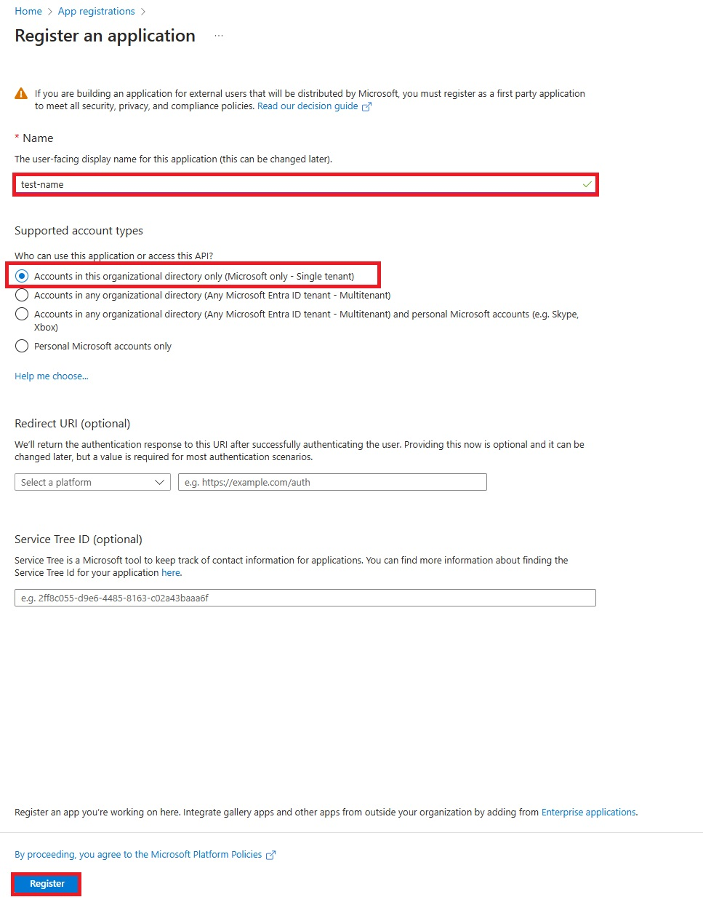
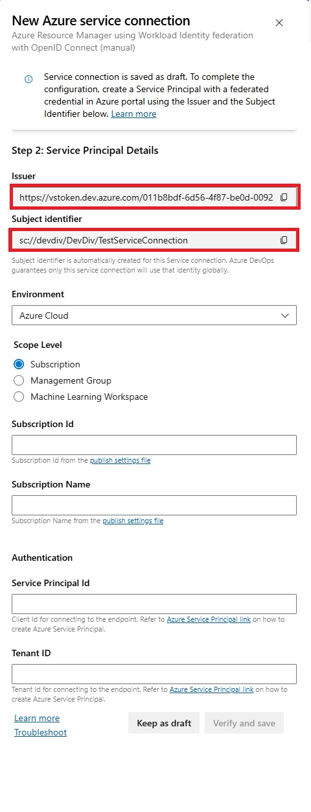

# Setting up workflow identity federation with Azure DevOps

This guide describes how to set up your Azure DevOps (ADO) and Azure environment to leverage [workflow identity federation](https://learn.microsoft.com/entra/workload-id/workload-identity-federation), enabling you to use
`AzureDevOpsSubscriptionProvider` provided in this section. See the [README](README.md#azure-devops-subscription-provider) for more details.

## 1. Create a new service principal

Create a new service principal on which you will assign the necessary permissions. In this example, we use an app registration:

1. Navigate to the [App Registrations](https://ms.portal.azure.com/#view/Microsoft_AAD_RegisteredApps/ApplicationsListBlade) page on the Azure portal
2. Click on `New Registration`

    

3. Assign any name
4. Make sure to select the first option for the account type (`Accounts in this organization directory only (Microsoft only - Single tenant)`)
5. Leave the Redirect URI and Service Tree ID fields empty
6. Click on `Register`

    

## 2. Create a new Azure DevOps (ADO) Service Connection:

Create a new ADO service connection under your organization's project. In this example, we create it under the DevDiv project:

 1. Navigate to the [organization's (DevDiv) ADO page](https://devdiv.visualstudio.com/DevDiv)
 2. Navigate to the settings page by clicking on the gear icon on the bottom left
 3. Select the ["service connections"](https://devdiv.visualstudio.com/DevDiv/_settings/adminservices) blade from the panel on the left

    

 4. Create a new service connection by clicking on the `New service connection` button

   

 5. Select `Azure Resource Manager` as the type
 6. Select `Workload Identity federation (manual)` for the authentication type
 7. Provide a new name for your new service connection
 8. Click on `Next`
 9.  This will create a new draft service connection, with the `issuer` and `subject identifier` fields already filled in.
 10. Leave this window open while you finish the next step, which will require those `issuer` and `subject identifier` fields, then you will return to this window to finish creating the service principal

   

## 3. Create a federated credential:

Create a new "federated credential" on your service principal to connect it to your new service connection:

 1. Navigate back to the Azure Portal page for your service connection (app registration) from step 1
 2. Navigate to the `Certificates & secrets` blade
 3. Navigate to the `Federated credentials` tab
 4. Click on the `Add credential` button

   

 5. For the scenario, select `Other issuer`
 6. For the `issuer` and `subject identifier` fields, fill in with the details of your draft service connection from the previous step
 7. Select a new name for your new federated credential

    

 8. Click on `Add`

## 4. (Temporary but required) Grant your service principal reader role on the desired subscription:

This step is not required for running your tests, but _is_ required to finish creating the service connection. This should be revoked after successful creation of the service connection and only necessary roles applied to the service principal.

 1. On the Azure Portal, navigate to the page for the subscription you want the service principal to have access to.
 2. Navigate to the `Access control (IAM)` blade

    

 3. Navigate to the `Roles` tab
 4. Click on the `+ Add` button, and choose `Add role assignment`

   

 5. Choose `Reader` and click `Next`
 6. Choose `User, group, or service principal`, then click on `+ Select members`

   

 7. Select your service principal from step 1
 8. Click on `Review and assign`

## 5. Finish creating your service connection:

Finish creating the draft service connection you created in step 2.

 1. Navigate back to your draft service connection from step 2
 2. For Environment, select `Azure Cloud`
 3. For Scope Level, choose `Subscription`
 4. Under `Subscription Id`, and `Subscription Name`, write the subscription ID and name (must provide both) for the desired subscription
 5. For `Service Principal Id`, provide the `Application (client) ID` of your app registration from step 1 (can be found in the `Overview` blade)
 6. For the `Tenant ID`, provide the `Directory (tenant) ID` of your app registration from step 1 (can be found in `Overview` blade)
 7. Click on `Verify and save`

## 6. Revoke unnecessary read access and assign only necessary roles

Revoke the `Reader` role on the subscription for the service connection after it is created. This is no longer necessary.

 1. Navigate to `Access control (IAM)` blade.
 2. Under the `Role assignments` tab, find the role assignment corresponding to the App registered on step 1
 3. Click on `Remove` then `Yes`
 4. You can then assign the required roles to specific resources only if required, instead of assigning `Reader` role to the entire subscription.

## 7. Create a dummy Key Vault

A dummy Key vault step is required to propagate the necessary environment variables in the context of the pipeline.

 1. Create a new Key Vault resource in the subscription you want to test on
 2. Give it a new name as appropriate. You can keep the default settings

    

## 8. Assign your service principal "key vault reader" role on the dummy Key Vault:

 1. Navigate to `Access control (IAM)` blade on your newly created dummy key vault

   

 2. Navigate to the `Roles` tab
 3. Click on the `+ Add` button, and choose `Add role assignment`

   

 4. Choose `Key Vault Reader` (**NOT** `Reader`) and click `Next`
 5. Choose `User, group, or service principal`, then click on `+ Select members`

   

 6. Select your app registration from step 1
 7. Click on `Review and assign`

## 9. Add the dummy Key Vault step in the pipeline

To ensure that the appropriate env variables are propagated in the context of running the pipeline, a dummy Key Vault step is required in that pipeline:

 1. In the desired pipeline's `.yml` file, add a step as below. The `azureSubscription` field should correspond to the name of your service connection from step 2, while the `keyVaultName` field should correspond to the dummy key vault created in step 7:

     ```yml
      # This gives the TestServiceConnection service connection access to this pipeline.
     - task: AzureKeyVault@1
       displayName: 'Authorize TestServiceConnection service connection'
       inputs:
         azureSubscription: 'TestServiceConnection'
         KeyVaultName: 'TestDummyKeyVault'
     ```

 2. In the step which runs your code (e.g., the npm test step), make sure that the `$(System.AccessToken)` variable is manually propagated as a `SYSTEM_ACCESSTOKEN` environment variable. All other required environment variables should be propagated automatically:

     ```yml
     - task: Npm@1
       displayName: "Test"
       inputs:
         command: custom
         customCommand: test
      env:
         SYSTEM_ACCESSTOKEN: $(System.AccessToken)
        ```

## 10. Pass the appropriate values to identify your service connection:

The constructor for `AzureDevOpsSubscriptionProvider` expects three arguments in an initializer object in order to identify your service connection you setup in step 5.

These are:

- `serviceConnectionId`: The resource ID of the service connection created in step 2, which can be found on the `resourceId` field of the URL at the address bar, when viewing the service connection in the Azure DevOps portal
- `domain`: The `Tenant ID` field of the service connection properties, which can be accessed by clicking "Edit" on the service connection page
- `clientId`: The `Service Principal Id` field of the service connection properties, which can be accessed by clicking "Edit" on the service connection page

  

Make sure you pass an object containing these variables for the `new AzureDevOpsServiceProvider()` constructor. These values are _not_ secrets, so they can be set as environment variables, assigned as pipeline variables in ADO, accessed and assigned using an Azure Key Vault step, or even manually hardcoded in code (not recommended).
