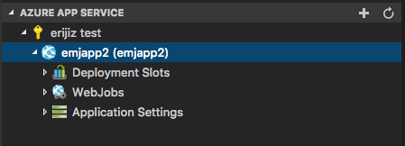

# VSCode Azure SDK for Node.js - Azure Utils (Preview)

[](https://dev.azure.com/ms-azuretools/AzCode/_build/latest?definitionId=17)

This package provides common Azure utilities for Azure VS Code extensions, and is intented to be used alongside @microsoft/vscode-azext-utils.

## Usage

You must call `registerAzureUtilsExtensionVariables` first in your extension's `activate()` method. The first parameter of the function passed in will always be an `IActionContext`, which allows you to specify custom telemetry and describes the behavior of this command. The simplest example is to register a command (in this case, refreshing a node):

```typescript
registerAzureUtilsExtensionVariables(...);
registerCommand('yourExtension.Refresh', (context: IActionContext, node: AzExtTreeItem) => {
    context.telemetry.properties.customProp = "example prop";
    context.telemetry.measurements.customMeas = 49;
    node.refresh();
});
```

## Azure Extension Tree Data Provider



### Display Azure Resources

Follow these steps to create your basic Azure Tree:

1. Create an `AzExtTreeItem` (or `AzExtParentTreeItem`) describing the items to be displayed under your subscription:

   ```typescript
   export class WebAppTreeItem extends AzExtTreeItem {
     public static contextValue: string = "azureWebApp";
     public readonly contextValue: string = WebAppTreeItem.contextValue;
     private readonly _site: Site;
     constructor(parent: AzExtParentTreeItem, site: Site) {
       super(parent);
       this._site = site;
     }

     public get id(): string {
       return this._site.id;
     }

     public get label(): string {
       return this._site.name;
     }
   }
   ```

1. Create a `SubscriptionTreeItemBase` that provides the tree items you just implemented. It must implement at least `hasMoreChildrenImpl` and `loadMoreChildrenImpl`:

   > NOTE: Methods suffixed with `Impl` should not be called directly - just implemented.

   ```typescript
   export class SubscriptionTreeItem extends SubscriptionTreeItemBase {
       private _nextLink: string | undefined;

       public hasMoreChildrenImpl(): boolean {
           return this._nextLink !== undefined;
       }

       public async loadMoreChildrenImpl(clearCache: boolean, _context: IActionContext): Promise<WebAppTreeItem[]> {
           if (clearCache) {
               this._nextLink = undefined;
           }

           const client: WebSiteManagementClient = createAzureClient(this.root, WebSiteManagementClient);
           const webAppCollection: WebAppCollection = this._nextLink === undefined ?
               await client.webApps.list() :
               await client.webApps.listNext(this._nextLink);
           this._nextLink = webAppCollection.nextLink;
           return webAppCollection.map((site: Site) => new WebAppTreeItem(this, site)));
       }
   }
   ```

1. Create an `AzureAccountTreeItemBase` that provides the subscriptions you just implemented. It must implement at least `createSubscriptionTreeItem`:
   ```typescript
   export class AzureAccountTreeItem extends AzureAccountTreeItemBase {
     public createSubscriptionTreeItem(root: ISubscriptionContext): SubscriptionTreeItemBase {
       return new SubscriptionTreeItem(this, root);
     }
   }
   ```
1. Finally, set up the tree in your extension's `activate()` method. Instantiate an `AzureAccountTreeItem` and add it to `context.subscriptions` since it's a disposable. Then instantiate an `AzExtTreeDataProvider`, passing in your root tree item and the `loadMoreCommandId` (which maps the 'Load More...' node to the command registered by your extension).
   ```typescript
   const azureAccountTreeItem = new AzureAccountTreeItem();
   context.subscriptions.push(azureAccountTreeItem);
   const treeDataProvider = new AzExtTreeDataProvider(azureAccountTreeItem, "appService.loadMore");
   context.subscriptions.push(vscode.window.createTreeView("azureAppService", { treeDataProvider }));
   ```

## License

[MIT](LICENSE.md)
